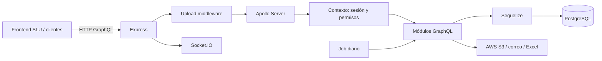

# Arquitectura del backend SLU

## Visión general

El backend SLU es una API GraphQL modular construida sobre Express y Apollo Server. Centraliza reglas de autorización, acceso a PostgreSQL y servicios auxiliares para los dominios de operación de reaseguros.



## Inicio y transporte

`server.js` crea la aplicación Express y configura:

- CORS con orígenes permitidos y credenciales.
- Parseo JSON y URL-encoded con límite de 25 MB.
- `graphql-upload` para hasta 50 archivos de 30 MB cada uno.
- Apollo Server con endpoint GraphQL en `/`.
- Timeout HTTP de cinco minutos.
- Socket.IO y el trabajo diario de notificaciones de vencimiento de garantías tras iniciar el servidor.

El puerto se obtiene de `PORT` y, si no existe, usa `5001`.

## Contexto, autenticación y autorización

Para cada solicitud GraphQL, Apollo construye un contexto en `server.js`:

1. Lee el encabezado de autorización.
2. `middlewares/header-cookie.js` resuelve el usuario autenticado.
3. `middlewares/permissions.js` verifica el acceso a la vista/acción solicitada.
4. Expone `req`, `res`, `headers` y `user` a los resolvers.

Los JWT se crean y validan en `middlewares/auth-helper.js`. Las claves y datos sensibles deben proceder exclusivamente del entorno; no se deben agregar secretos al código ni a la documentación.

## Composición del esquema GraphQL

El esquema se arma al inicio, no módulo a módulo en tiempo de ejecución:

```text
server.js
  -> modules/index.js
  -> módulos exportan typeDefs + resolvers
  -> makeExecutableSchema(typeDefs, resolvers)
  -> Apollo Server
```

`modules/index.js` es el registro explícito de módulos. Incluye dominios como usuarios, roles, suscripciones, cotizaciones, endosos, facultativos, documentos, pagos, notificaciones, reportes, reaseguradores, capacidad y catálogos.

### Convención de módulo

```text
modules/<dominio>/
├── typeDefs.js       # Tipos, inputs, queries y mutations GraphQL
├── queries.js        # Resolvers de Query
├── mutations.js      # Resolvers de Mutation
├── general.js        # Lógica auxiliar, si aplica
└── index.js          # Exporta typeDefs y resolvers
```

No todos los módulos tienen exactamente los mismos archivos, pero `index.js` es la frontera que los incorpora al esquema.

## Persistencia

La capa de persistencia se encuentra en `application/repository-slu/`:

- `models/` contiene modelos Sequelize y asociaciones.
- `migrations/` mantiene la evolución del esquema.
- `config/` conserva configuración asociada al repositorio.
- `config/database.js` crea y exporta la instancia Sequelize PostgreSQL.

Los valores de conexión se reciben mediante `PG_HOST`, `PG_PORT`, `PG_USERNAME`, `PG_PASSWORD` y `DATABASE`. La configuración actual requiere SSL para la conexión PostgreSQL.

## Servicios e integraciones

| Integración | Uso |
| --- | --- |
| PostgreSQL + Sequelize | Datos transaccionales y catálogos. |
| AWS S3 | Almacenamiento y descarga de documentos. |
| Socket.IO | Comunicación de eventos en tiempo real. |
| Nodemailer / Twilio | Notificaciones y mensajería, donde aplique. |
| ExcelJS | Generación de reportes y plantillas Excel. |
| node-cron | Ejecución de tareas programadas. |

Los generadores Excel se agrupan en `reports/` y los recursos de plantilla en `assets/excel/`. Los servicios transversales están en `services/`, `middlewares/` y `utils/`.

## Flujo de una operación GraphQL

```text
Cliente
  -> CORS / body parser / carga de archivos
  -> construcción de contexto (usuario + permiso)
  -> resolver del módulo
  -> modelo Sequelize o servicio externo
  -> respuesta GraphQL
```

Los errores de autenticación o de permiso deben conservar un comportamiento predecible para el cliente. La validación de entrada y las reglas de negocio deben ubicarse cerca del resolver o en un servicio reutilizable, no en el arranque del servidor.

## Cambios de esquema de datos

Una modificación de base de datos requiere modelo, migración revisada y coordinación previa para entornos compartidos. Los scripts del repositorio permiten generar, aplicar y revertir migraciones, pero una reversión puede afectar datos; no la ejecute sin validar el destino y el impacto.

## Pruebas y operación

Las pruebas se ejecutan con Vitest desde la raíz del proyecto. El despliegue compila el directorio `server/` en `dist/` y reinicia el proceso administrado por el entorno de infraestructura.

```bash
npm test
npm run coverage
npm run build
```

## Límites y decisiones actuales

- La API usa GraphQL como interfaz pública única en `/`; no existe una capa REST documentada en este repositorio.
- El registro de módulos es manual, lo cual facilita revisar el alcance del esquema pero requiere actualizar `modules/index.js` en cada módulo nuevo.
- Express, Apollo Server y Socket.IO comparten el mismo proceso HTTP.

